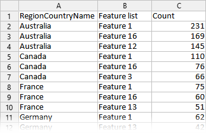

# DevExpress Data Processing API (MVP)

**DevExpress Data Processing API** is a .NET library that allows you to convert your data (including ETL and data analysis) into usable and desired form.

Typical scenarios:

- Add ETL (Extract, Transform, Load) capabilities to .NET applications.
- Use data shaping (grouping, sorting, filtering, applying analytics functions) before you display data in a UI application, regardless of platform.

The main features of the presented library:

- Connect to different data sources (relational databases, web services, Excel spreadsheets, JSON data, and so on) using a unified interface.
- Process data at runtime in the application memory.
- Embed business logic written in .NET at any point in your data processing.
- Use functions to clean and structure data alongside with analytical functions.
- Debug your app using a wide range of API.
- Transform your data quickly from raw data to final output.

> DevExpress Data Processing API is a prototype (MVP) of a new product and is therefore not yet a part of the DevExpress product line.

This example is created to collect feedback and usage data. If you are interested in DevExpress Data Processing API, leave a comment under our [blog post](https://community.devexpress.com/blogs/analytics/archive/2021/12/16/data-processing-api-test-the-early-prototype.aspx) or create a ticket in our [Support Center](https://supportcenter.devexpress.com/ticket/list).

## About Example

The following repository contains a .NET 5.0 solution with three projects that show how to use DevExpress Data-Processing API.

To launch the example, you need to update your DevExpress NuGet packages to **v21.2.4**. You can find the instructions for upgrading in the following section: [Install DevExpress Controls Using NuGet Packages](https://docs.devexpress.com/GeneralInformation/115912/installation/install-devexpress-controls-using-nuget-packages).

> For .NET Framework, reference the [DevExpress.DataProcessingApi.MVP.NetFramework.dll](dll) and DevExpress libraries v.21.2.4 in your project.

### ConsoleExample

**View file**: [Program.cs](./ConsoleExample/Program.cs)

The following project is an example that transforms the user survey data in the JSON format and data about users from an XLSX file in the following way:
- Joins these two data flows to get a one data source. The "Feature list" column is an array of data. The `Unfold` operation creates a new row for each item in the array.
- Aggregates data by "RegionCountryName" and "Feature list".
- Calculates the top 3 achievements for each country.
- Sorts data.
- Uploads data to an XLSX file.

The resulting XLSX file:

### CodeSamples

**View file**: [Program.cs](./CodeSamples/Program.cs)

The following project contains unit tests that cover different scenarios.

You can use [Test Explorer](https://docs.microsoft.com/en-us/visualstudio/test/run-unit-tests-with-test-explorer) in Visual Studio to launch and debug these code samples or launch them in a console application (view the `Main()` function for details).

### PerformanceExample

**View file**: [Program.cs](./PerformanceExample/Program.cs)

This example compares different data processing technologies:

- DevExpress Data-Processing API
- Microsoft Linq
- Microsoft Parallel Linq

[More about performance](#performance)

## How to Work with this API

### Common Concepts

The common algorithm: 

1. Create a new data flow (`DataFlow`) and use one of the functions to load data (for example, `FromCsv` or `FromDatabase`).
1. Use functions to clean and structure your data and apply analytical functions (for example, `ProcessColumn`, `AddColumn`, `Join`, `Aggregate`, and so on).
1. Define the output data format (for example, `ToExcel`, `ToDataTable`).
1. Execute the previously defined data flow to generate resulting data (`Execute`).

### Load Data

- From a CVS file: `FromCsv`
- From a database: `FromDatabase`
- From Excel spreadsheets (XLSX and XLS files): [`FromExcel`](https://github.com/DevExpress/dataprocessingapi-mvp-example/blob/main/CodeSamples/Program.cs#L49-L57)
- From a Web Service (JSON): `FromJsonFile` and [`FromJsonUrl`](https://github.com/DevExpress/dataprocessingapi-mvp-example/blob/main/CodeSamples/Program.cs#L69-L80)
- From .NET object: [`FromObject`](https://github.com/DevExpress/dataprocessingapi-mvp-example/blob/main/CodeSamples/Program.cs#L59-L67)

### Transform Data

- Join data from different sources: [`Join`](https://github.com/DevExpress/dataprocessingapi-mvp-example/blob/main/CodeSamples/Program.cs#L83-L97)
- Unfold array values and display a new data row for every element in the array: [`Unfold`](https://github.com/DevExpress/dataprocessingapi-mvp-example/blob/main/ConsoleExample/Program.cs#L28)
- Add columns: [`AddColumn`](https://github.com/DevExpress/dataprocessingapi-mvp-example/blob/main/CodeSamples/Program.cs#L148-L158) (using criteria operator or in code)
- Modify column data: [`ProcessColumn`](https://github.com/DevExpress/dataprocessingapi-mvp-example/blob/main/CodeSamples/Program.cs#L186-L197)
- Filter data: [`Filter`](https://github.com/DevExpress/dataprocessingapi-mvp-example/blob/main/CodeSamples/Program.cs#L111-L121) (using criteria operator or in code)
- Sort data: [`Sort`](https://github.com/DevExpress/dataprocessingapi-mvp-example/blob/main/CodeSamples/Program.cs#L199-L211)
- Manage columns: `SelectColumns`, [`RenameColumns`](https://github.com/DevExpress/dataprocessingapi-mvp-example/blob/main/CodeSamples/Program.cs#L160-L172), [`RemoveColumn`](https://github.com/DevExpress/dataprocessingapi-mvp-example/blob/main/CodeSamples/Program.cs#L174-L183)/`RemoveColumns`

### Analyze Data

- TopN: [`Top`](https://github.com/DevExpress/dataprocessingapi-mvp-example/blob/main/CodeSamples/Program.cs#L236-L245), `Bottom`
- Data aggregation: [`Aggregate`](https://github.com/DevExpress/dataprocessingapi-mvp-example/blob/main/CodeSamples/Program.cs#L216-L233)

### Upload Data

- Upload data to a stream that contains an XLSX file: [`ToExcel`](https://github.com/DevExpress/dataprocessingapi-mvp-example/blob/main/CodeSamples/Program.cs#L250-L258)
- Upload data to a JSON string: [`ToJsonString`](https://github.com/DevExpress/dataprocessingapi-mvp-example/blob/main/CodeSamples/Program.cs#L260-L267)
- Upload data to a .NET object: [`ToDataTable`](https://github.com/DevExpress/dataprocessingapi-mvp-example/blob/main/CodeSamples/Program.cs#L52), [`ToEnumerable`](https://github.com/DevExpress/dataprocessingapi-mvp-example/blob/main/CodeSamples/Program.cs#L277-L285)

### Debug

- Get data for each step in the processed data flow: [`Debug`](https://github.com/DevExpress/dataprocessingapi-mvp-example/blob/main/CodeSamples/Program.cs#L289-L301)

## Performance

- Data is stored by column ([column-oriented DBMS](https://en.wikipedia.org/wiki/Column-oriented_DBMS)). This approach allows us to optimize data analysis operations, such as data aggregation, join data from different sources, and so on.
- Data engine supports multi-threaded data calculation to handle a large amount of data efficiently.
- An optimized graph of data operations.

Our experiments showed that DevExpress Data Processing API can be faster or equal to Parallel Linq in aggregation calculation tasks (grouping and sums calculation).

> Note that we made a number of assumptions in the MVP implementation which do not fully reveal the performance. At the same time, performance can depend on many factors (for example, just-in-time (JIT) compilation). If you encounter performance issues, please fell free to describe your scenario in our [Support Center](https://supportcenter.devexpress.com/ticket/list).

## Product Development Plans
If we decide to release the product, we plan to develop in the following directions:

- Support more popular data sources and a variety of upload methods.
- Add more features to solve the most popular ETL and analytics problems.
- Create tools for developers to simplify the creating and debugging of data flows, including the development of Visual Studio built-in tools.
- Performance optimization.
- Improve diagnostic logging and error output.
- Integration with DevExpress controls: Winforms, WPF, Blazor (as ASP.NET Core Backend).

Your opinion matters to us. Please share your thoughts in comments in our blog post: [Data Processing API - Test the early prototype](https://community.devexpress.com/blogs/analytics/archive/2021/12/16/data-processing-api-test-the-early-prototype.aspx).
